# 🚖 Taxímetro Digital - Proyecto F5

## Descripción

Este es mi primer proyecto en F5, donde desarrollo un **prototipo de taxímetro digital con Python**.
El objetivo es modernizar el sistema de cobro en taxis mediante un programa capaz de calcular tarifas en tiempo real, brindando precisión y eficiencia.

## Índice

- [Descripción](#descripción)
- [¿Qué hace este proyecto?](#qué-hace-este-proyecto)
- [Tecnologías](#tecnologías)
- [Dashboard en Trello](#dashboard-en-trello)
- [Configuración del proyecto (implementación propia)](#configuración-del-proyecto-implementación-propia)
- [Crear el archivo taximetropy](#crear-el-archivo-taximetropy)
- [Lógica del proyecto](#lógica-del-proyecto)
- [Diagrama de flujo del programa](#diagrama-de-flujo-del-programa)
- [Cómo desplegar y ejecutar mi proyecto](#cómo-desplegar-y-ejecutar-mi-proyecto)
- [Primera versión (Nivel esencial)](#primera-versión-nivel-esencial)
- [Segunda versión (Nivel medio)](#segunda-versión-nivel-medio)
- [Tercera versión (Nivel experto) – Migración a SQLite](#tercera-versión-nivel-experto---migración-completa-a-sqlite)
- [Cuarta versión (Nivel experto) – Dockerización y web](#cuarta-versión-nivel-experto)


## ¿Qué hace este proyecto?

- Calcula automáticamente la tarifa según el tiempo detenido (2 cént/s) o en movimiento (5 cént/s).
- Permite iniciar, finalizar y reiniciar trayectos desde la línea de comandos.
- Escalable a niveles más avanzados: logs, tests, registros históricos, configuración de precios, OOP, GUI, base de datos, Docker y versión web.

## Tecnologías

- Python
- Git & GitHub
- Herramientas de gestión (Trello/Jira)
- + Bibliotecas adicionales según el nivel: `logging`, `unittest`, `tkinter`, `sqlite3`, `docker`, `Flask/Django`.


## Dashboard en Trello

Para organizar la hoja de ruta del proyecto, crea una cuenta en [Trello](https://trello.com/) y genera un tablero (dashboard) donde puedas planificar y hacer seguimiento de las tareas.

- ¿Qué es Trello?
  Es una herramienta online para la gestión de proyectos mediante tableros y tarjetas.
  Puedes ver una introducción en este video: [¿Qué es Trello? (YouTube)](https://www.youtube.com/watch?v=gGcLLDRVYcc)

Ejemplo de tablero en Trello:


## Configuración del proyecto (implementación propia)

### 1. Crear el proyecto

```
mkdir taximetro
cd taximetro
```

### 2. Crear el entorno virtual

```
python3 -m venv .venv
```

Esto creará un entorno virtual llamado .venv dentro de la carpeta taximetro.
Es una buena práctica llamarlo .venv, pero puedes usar otro nombre si lo prefieres.

### 3. Activar el entorno virtual

En Linux o macOS:

```
source .venv/bin/activate
```

En Windows (CMD):

```
.venv\Scripts\activate
```

En Windows (PowerShell):

```
.venv\Scripts\Activate.ps1
```

Una vez activado, deberías ver algo así en tu terminal:

```
(.venv) usuario@pc:~/taximetro$
```

### 4. Desactivar el entorno virtual

```
deactivate
```

## Crear el archivo taximetro.py

Este archivo lo debes crear fuera de la carpeta .venv, en la raíz de tu carpeta taximetro. Así tu estructura se verá así:

```
taximetro/
├── .venv/
├── taximetro.py
```


Importante:
Nunca pongas tus scripts o archivos de código dentro de .venv. Esa carpeta es solo para los paquetes y configuraciones internas del entorno virtual.


## Lógica del proyecto

El taxímetro digital funciona simulando el cálculo de tarifas en tiempo real según el estado del taxi: detenido (`stop`) o en movimiento (`move`). El usuario controla el estado mediante comandos en la consola. El sistema registra el tiempo transcurrido en cada estado y aplica la tarifa correspondiente: 0,02 €/s cuando está detenido y 0,05 €/s cuando está en movimiento.

El flujo principal es:
- El usuario inicia un viaje con el comando `start`.
- Puede alternar entre los estados `stop` y `move` usando el comando `m`.
- El comando `finish` finaliza el viaje, mostrando el tiempo total en cada estado y el importe a pagar.
- El comando `exit` permite salir del programa.

El programa está estructurado en clases:
- **Trip**: Gestiona el estado, los tiempos y el cálculo de la tarifa de cada viaje.
- **ConsoleView**: Se encarga de la interacción con el usuario (mensajes, menús y entradas).
- **Taximeter**: Controla el flujo general, la lógica de comandos y la gestión de viajes.

Esta arquitectura orientada a objetos facilita la extensión del proyecto (por ejemplo, para añadir logs, historial de viajes, o una interfaz gráfica) y asegura un código limpio, modular y fácil de mantener.


## Diagrama de flujo del programa

Este diagrama muestra el flujo principal del taxímetro digital.
Ayuda a visualizar cómo el programa recibe comandos y cómo gestiona el estado del viaje.

- El programa inicia mostrando un menú y esperando un comando del usuario.
- Con `start` se crea un nuevo viaje (si ya existe, muestra error).
- Con `m` se alterna entre detenido y en movimiento (si no hay viaje activo, muestra error).
- Con `finish` se cobra el viaje, guarda y regresa al menú.
- Con `exit` termina el programa.
- Cualquier otro comando muestra un error.

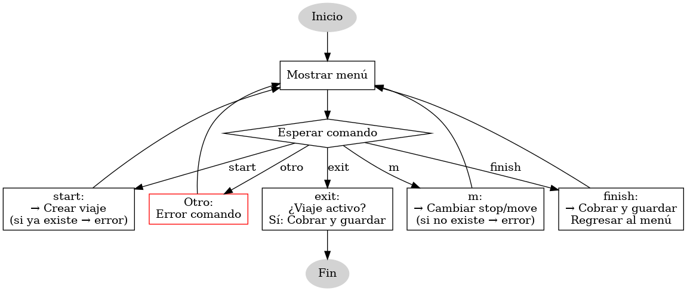


## Cómo desplegar y ejecutar mi proyecto

### Clona el repositorio
```
git clone git@github.com:Factoria-F5-madrid/Proyecto1-CristianYepes.git
```

```
cd Proyecto1-CristianYepes.git
```

### Activa el entorno virtual

```
source .venv/bin/activate
```

### Cómo ejecutar el taxímetro

Asegúrate de estar en la carpeta del proyecto y con el entorno virtual activado:

```
python3 tax5.py
```

## Primera versión (Nivel esencial)

Esta fue la primera versión del programa, diseñada para cumplir con el **nivel esencial del enunciado base**:

✅ Calcula tarifas:
-  Parado: 0,02 €/s
-  En movimiento: 0,05 €/s

✅ Permite:
- Iniciar un viaje (`start`)
- Cambiar estado entre `stop` y `move` (`m`)
- Finalizar viaje (`finish`) mostrando el total
- Salir del programa (`exit`)

### 🖥️ Capturas funcionamineto

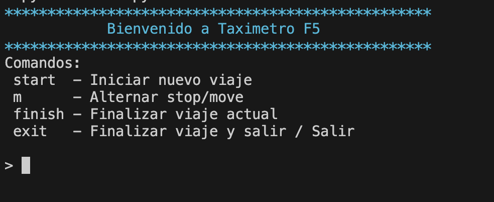

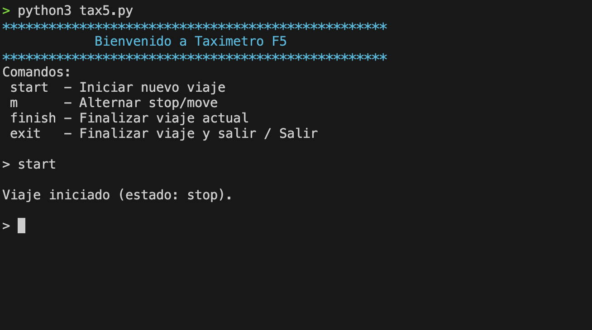

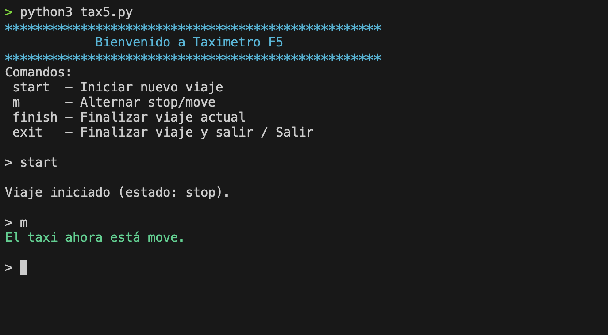

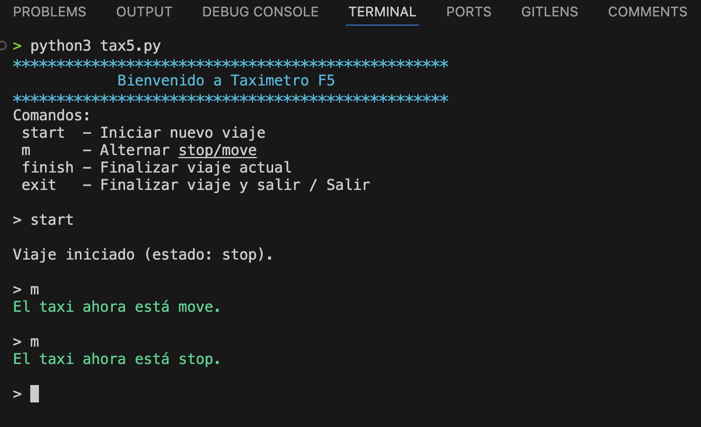

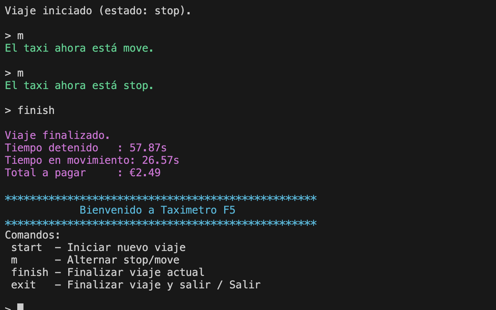


## Segunda versión (Nivel medio)

### Novedades principales

✅ **Sistema de logs:**
Registra eventos relevantes (inicio y fin de viajes, cambios de estado, errores) en un archivo de log, facilitando la trazabilidad del programa.

✅ **Historial de viajes:**
Cada vez que se finaliza un trayecto, se guarda un registro en un archivo de texto plano (`historial.txt`) con los tiempos y el importe, permitiendo consultar viajes pasados.

✅ **Configuración de precios:**
Permite modificar las tarifas por segundo para parado y movimiento, adaptándose a necesidades distintas (por ejemplo, simulaciones o pruebas con otras tarifas).

✅ **Tests unitarios:**
Se añadieron pruebas automáticas para verificar el cálculo de precios, el control de estados y las funciones principales, garantizando el correcto funcionamiento del programa a medida que crece.

Cómo ejecutar los tests

Primero instala `pytest` en tu entorno virtual:

```
pip install pytest
```

Guarda los archivos de prueba dentro de una carpeta **`tests/`** en la raíz del proyecto.

Luego ejecuta los tests con:

```
pytest -q
```


### 🖥️ Capturas funcionamiento

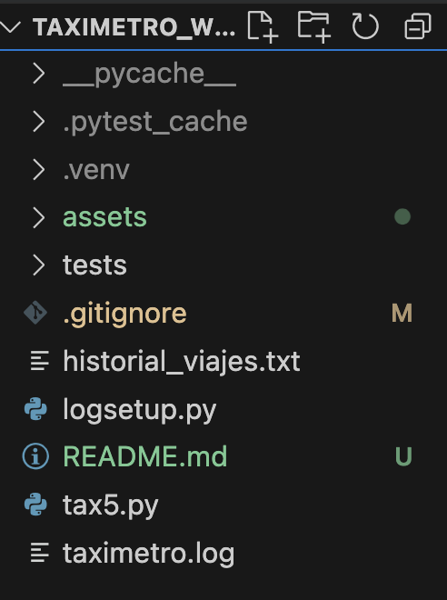

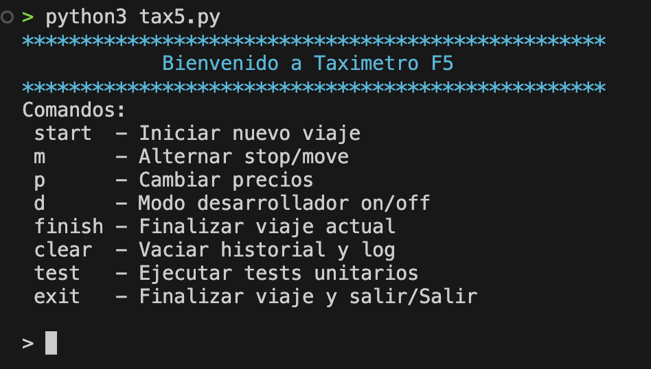

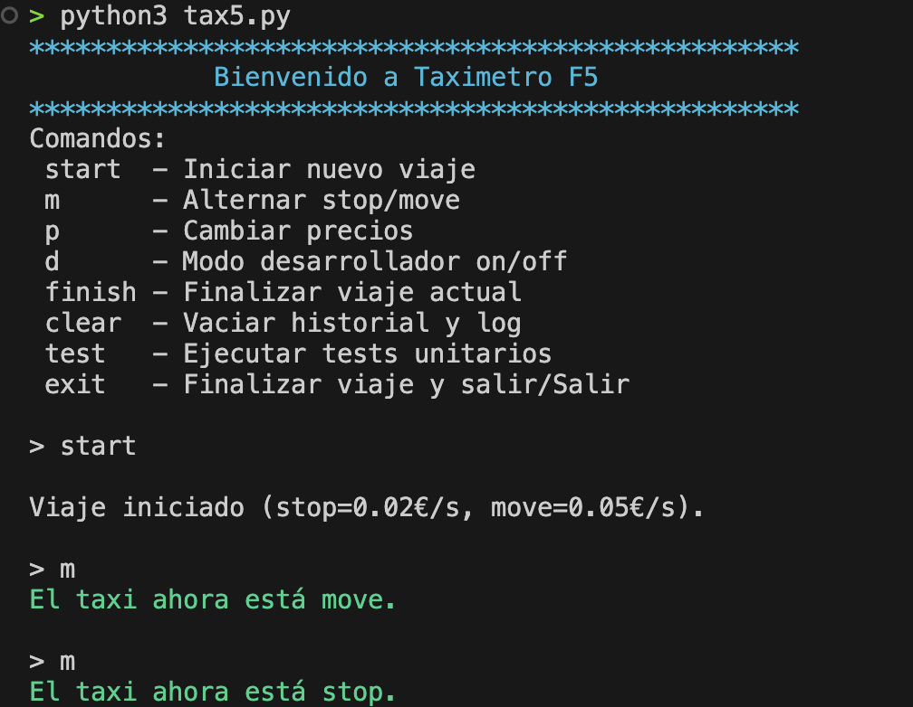

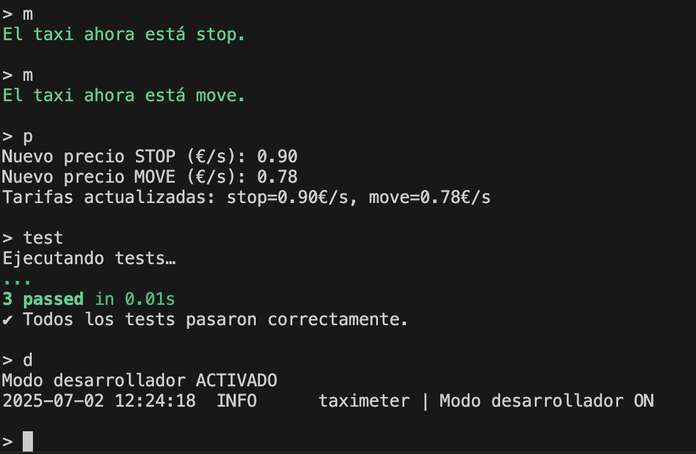

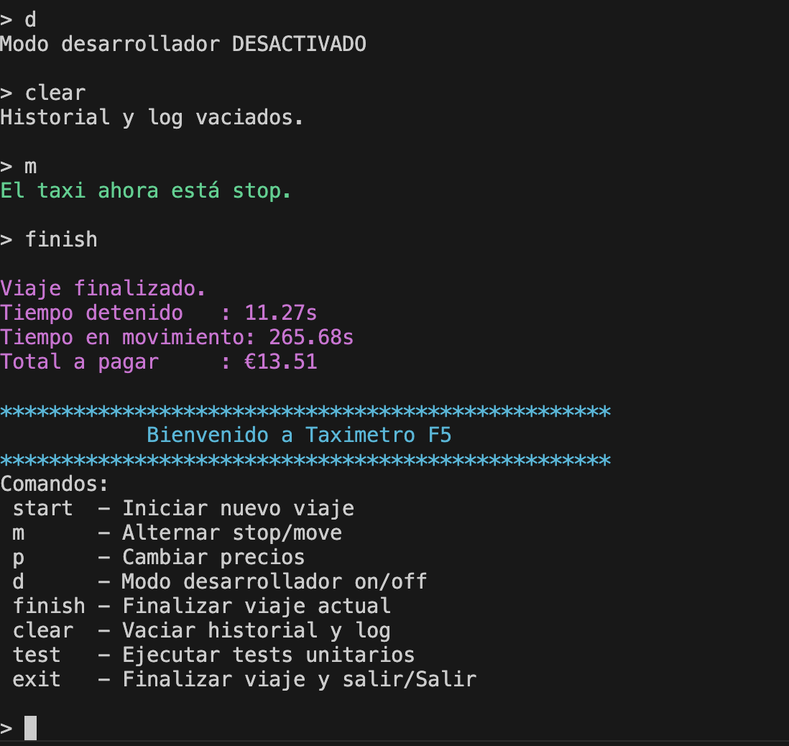


### 📂 Ejemplo del archivo historial_viajes.txt

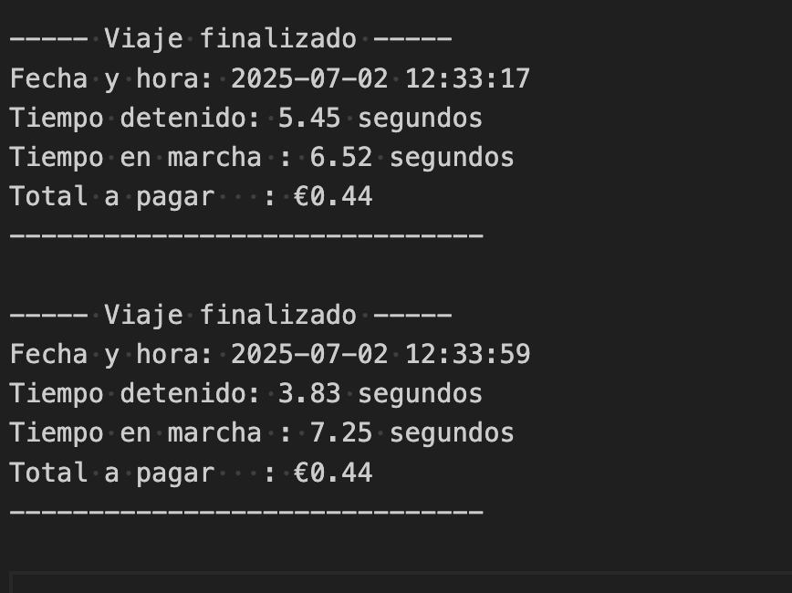

### 📄 Ejemplo del archivo taximetro.log

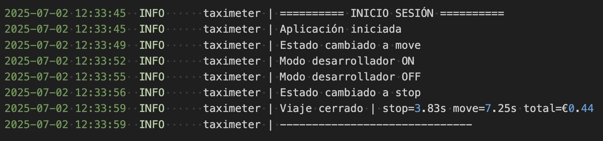


## Tercera versión (Nivel avanzado)

### ✅ Refactorización orientada a objetos (OOP)

Desde el inicio, este proyecto ha sido diseñado completamente en **OOP (Programación Orientada a Objetos)**, con clases bien separadas como:

- `Trip`: controla el estado del viaje, tiempos y cálculo de tarifas.
- `ConsoleView`: gestiona los mensajes mostrados al usuario y la entrada de comandos.
- `FileTripHistory`: guarda los trayectos finalizados en un archivo de texto.
- `Taximeter`: orquesta el funcionamiento general, comandos y flujos del programa.
- `AuthSystem`: gestiona el registro e inicio de sesión de los usuarios.

Este diseño modular permite que el código sea limpio, fácil de mantener y ampliable. Gracias a ello, se puede extender sin problemas a una API REST, a un frontend React o a integrar nuevas características como pagos, reportes o dashboards.

---

### ✅ Política de usuarios

Se añadió un **sistema de autenticación básica** que pide al usuario **registrarse o iniciar sesión** antes de poder usar el taxímetro. Así, cada trayecto queda asociado a un usuario.

- Los usuarios se almacenan en un archivo `users.txt` con el formato:
- usuario:contraseña

- ⚠️ Actualmente el sistema guarda las contraseñas en texto plano, lo que es adecuado solo para pruebas locales.
Está diseñado para migrarse fácilmente a un sistema con contraseñas cifradas (por ejemplo SHA256 o bcrypt) en el **nivel experto**, junto con el uso de una base de datos real.

---

### ✅ Trayectos vinculados a usuarios

Cada vez que un viaje termina, el programa guarda:

- El nombre del usuario que hizo el trayecto.
- El tiempo detenido y en marcha.
- El total a pagar.

Así se mantiene un historial detallado por usuario, listo para exportar o migrar a un sistema con consultas avanzadas.

---

### 📝 Resumen del nivel avanzado alcanzado

✅ Código modular con OOP desde el inicio.
✅ Sistema de usuarios con registro e inicio de sesión.
✅ Viajes asociados a usuarios, listos para persistencia avanzada.
✅ Preparado para migrar a cifrado de contraseñas y base de datos real.

---

### 🖥️ Capturas funcionamiento

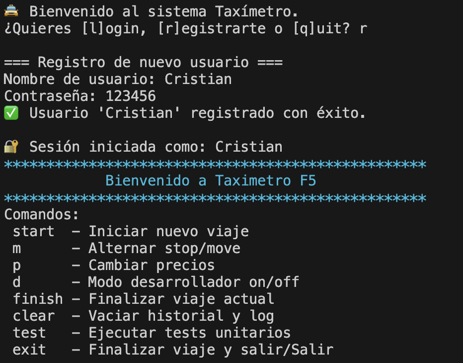

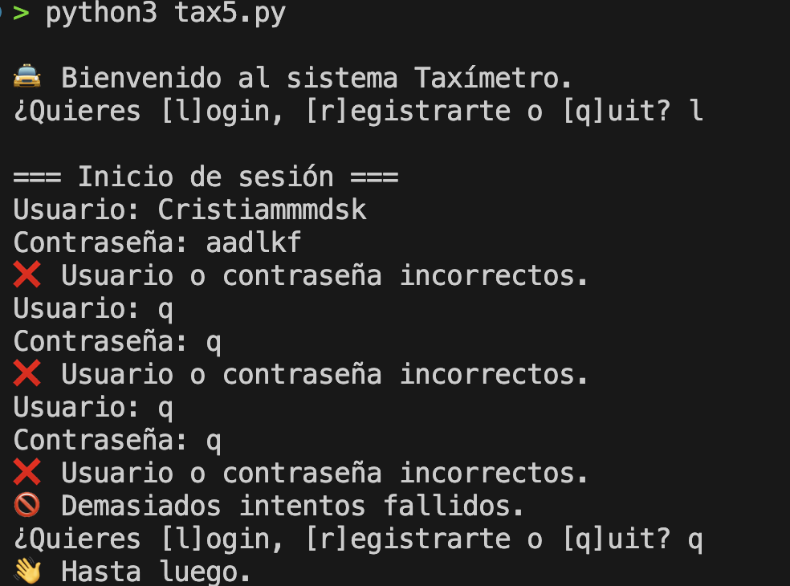

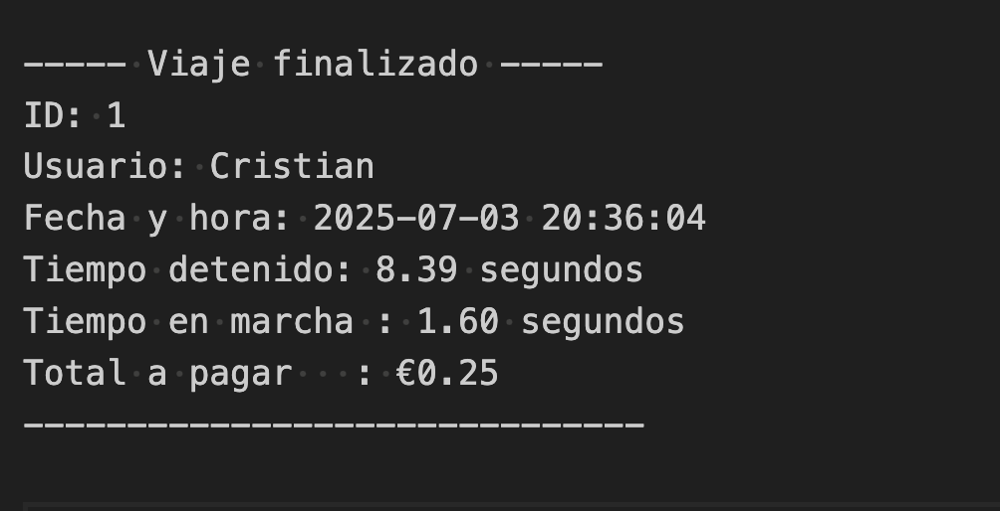


## Cuarta versión (Nivel experto)

### - Implementación 1️⃣ 🔗 Migración completa a SQLite
> Sustituimos TODOS los archivos de texto por una única base de datos **`taximetro.db`**.

### 1. ¿Por qué migrar?
| Problema con los TXT | Ventaja con SQLite |
|----------------------|--------------------|
| Difícil de consultar («grep» limitado). | Consultas SQL potentes (`SELECT`, `JOIN`, etc.). |
| Riesgo de inconsistencias al escribir desde varios hilos. | Transacciones atómicas (`BEGIN … COMMIT`). |
| No se puede relacionar usuarios ↔ viajes. | Integridad referencial (`FOREIGN KEY`). |
| Archivos crecen sin control. | Una sola BD con tablas compactas, fácil de respaldar. |

### 2. Estructura de la base de datos

| Tabla | Columnas clave | Para qué sirve |
|-------|---------------|----------------|
| **`users`** | `id`, `username`, `password` | Autenticación de usuarios. *(Contraseñas en texto plano por ahora – se hashificarán en la siguiente iteración).* |
| **`trips`** | `id`, `user_id`, `date`, `stop_time`, `move_time`, `total` | Historial de trayectos con relación 1-N (`user_id → users.id`). |
| **`logs`** | `id`, `timestamp`, `level`, `message` | Traza completa del programa (equivalente a `taximetro.log`). |

> Las tablas se crean automáticamente al primer arranque (`db.py → create_tables()`).

### 3. Cambios de código principales

| Elemento | Antes | Después |
|----------|-------|---------|
| **Usuarios** | `usuarios.txt` | `AuthSystem` → `users` |
| **Historial** | `FileTripHistory` + `historial_viajes.txt` | `TripRepository` → `trips` |
| **Logs** | `RotatingFileHandler` + `taximetro.log` | `DBLogHandler` → `logs` (archivo eliminado) |

### 4. Ejemplos

- 4.1 Abre el cliente de SQLite sobre tu base de datos:

```
sqlite3 taximetro.db
```
- 4.2 Últimos 5 viajes con su coste

```
SELECT t.id, u.username, t.date, t.total
FROM trips t
JOIN users u ON u.id = t.user_id
ORDER BY t.id DESC
LIMIT 5;
```

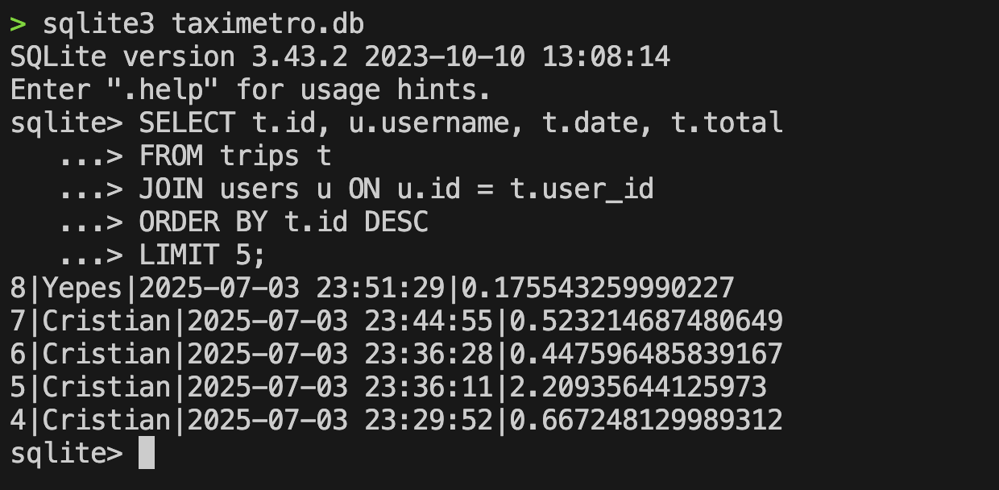

> ⚠️ **Advertencia de seguridad**
> Las contraseñas se almacenan **en texto plano** en la base de datos.
> Esto es adecuado únicamente para entornos de prueba o desarrollo local.
> En producción debes **nunca** guardar contraseñas sin cifrar: utiliza algoritmos como **bcrypt** o **SHA-256** con salt para proteger los datos de usuario.

### - Implementación 2️⃣ 🔗 Api Flask

## 🚀 Nueva Arquitectura: API REST

A continuación tienes un repaso de **todo lo que hemos hecho** al migrar tu taxímetro CLI a un backend desacoplado y un frontend web, y los **siguientes pasos** para terminar la parte React.

---

## 🛠️ 1. ¿Por qué separar en API + Front?

- **CLI original**
  Monolítico: lógica, persistencia y UI (texto) mezclados en `tax5.py` y `ConsoleView`. Difícil de evolucionar.

- **API REST (Flask + SQLite)**
  - Exponemos la lógica y la BD por HTTP/JSON.
  - Cualquiera (CLI, móvil, web) puede ser cliente.
  - Permite escalar e integrar nuevos clientes sin tocar el servidor.

- **Frontend React**
  - Interfaz gráfica en el navegador.
  - Consume la API con `fetch`/`axios`.
  - Independiente del backend: cambios de estilo o UX sin redeploy del servidor.

---

## ⚙️ 2. ¿Qué implementa ya la API?

1. **`api/app.py`**
   - Crea la app de Flask, activa CORS.
   - Inicializa SQLite (`taximetro.db`) y lo guarda en `app.config['DB']`.
   - Registra dos blueprints:
     - `/api/auth` → rutas de autenticación.
     - `/api/trips` → rutas de viajes.

2. **`api/routes_auth.py`**
   - **POST `/api/auth/register`**
     Recibe JSON `{ username, password }`. Inserta en tabla `users`.
   - **POST `/api/auth/login`**
     Recibe JSON `{ username, password }`. Comprueba en `users`. Devuelve ok o error.

3. **`api/routes_trips.py`**
   - **GET  `/api/trips/`**
     Lee header `X-User`, lista todos los viajes de ese usuario (`trips`).
   - **POST `/api/trips/`**
     Lee `X-User` y JSON `{ stop_time, move_time, total }`, inserta un nuevo viaje.

4. **Tablas en SQLite**
   - **`users`** `(id, username, password)`
   - **`trips`** `(id, user_id → users.id, date, stop_time, move_time, total)`
   - **`logs`**  `(id, timestamp, level, message)` reemplazando `taximetro.log`

---

¿Qué “lógica” guarda la API?

Registro y login
Inserta un registro en users cuando alguien se registra.
Comprueba credenciales leyendo de users al hacer login.
Inicio / fin de viaje
Cuando el frontend envía un POST /api/trips, la API calcula (ya lo hizo React) y almacena { user_id, date, stop_time, move_time, total } en trips.
Modo desarrollador & otros eventos
Cada vez que tu servidor emite un logger.info() o logger.error(), un handler especial lo graba en logs (antes iba a taximetro.log).


🔑 Resumen: La API no sólo “guarda las tablas”, sino que expone la lógica necesaria para manipular esas tablas de forma controlada y consistente desde cualquier cliente (CLI, React, móvil…).


## API REST con Flask

### Endpoints principales

1. **Autenticación**
   - **POST `/api/auth/register`**
     JSON `{ username, password }`, registra usuario.
   - **POST `/api/auth/login`**
     JSON `{ username, password }`, valida credenciales.

2. **Viajes**
   - **GET `/api/trips/`**
     Lee header `X-User`, lista todos los viajes de ese usuario (`trips`).
   - **POST `/api/trips/`**
     Lee `X-User` y JSON `{ stop_time, move_time, total }`, inserta un nuevo viaje.

3. **Tablas en SQLite**
   - **`users`** `(id, username, password)`
   - **`trips`** `(id, user_id → users.id, date, stop_time, move_time, total)`
   - **`logs`**  `(id, timestamp, level, message)` reemplazando `taximetro.log`

---

¿Qué "lógica" guarda la API?

Registro y login
Inserta un registro en users cuando alguien se registra.
Comprueba credenciales leyendo de users al hacer login.
Inicio / fin de viaje
Cuando el frontend envía un POST /api/trips, la API calcula (ya lo hizo React) y almacena { user_id, date, stop_time, move_time, total } en trips.

## 2️⃣ Instala dependencias

Si aún no tienes Flask, flask-cors, etc.

```
pip install flask flask-cors
```

## 3️⃣ Arranca el servidor Flask

```
python app.py
```

Verás:
* Running on http://127.0.0.1:5000/

Tu API ahora está escuchando en localhost:5000.

## 🚀 Qué hace cada archivo principal

| Archivo | Descripción |
|---------|-------------|
| app.py | Arranca Flask, configura CORS y monta los blueprints de auth y trips |
| routes_auth.py | Tiene /api/auth/register y /api/auth/login |
| routes_trips.py | Tiene /api/trips/ GET y POST para listar o guardar viajes |
| trip_repo.py | Se encarga de leer y guardar los viajes en SQLite |
| auth.py | Controla login y registro de usuarios |

##  Cómo probar la API con curl

✅ 1. Registrar un usuario

```
curl -X POST http://127.0.0.1:5000/api/auth/register \
  -H "Content-Type: application/json" \
  -d '{"username":"test_user", "password":"1234"}'
```

✅ 2. Guardar un viaje para ese usuario

```
curl -X POST http://127.0.0.1:5000/api/trips/ \
  -H "Content-Type: application/json" \
  -H "X-User: test_user" \
  -d '{"stop_time": 5, "move_time": 3, "total": 0.29}'
```

✅ 3. Listar viajes de ese usuario

```
curl -H "X-User: test_user" http://127.0.0.1:5000/api/trips/
```

Te devolverá:

```
{
  "trips": [
    {
      "id": 1,
      "date": "2025-07-07 16:09:00",
      "stop_time": 5.0,
      "move_time": 3.0,
      "total": 0.29
    }
  ]
}
```

⏹ Cómo detener el servidor
Ve a la terminal donde lanzaste python app.py y presiona:

📝 Tips rápidos
✅ Puedes probar la API con Postman o Insomnia, recuerda siempre incluir el header:
